## CreateDutMap 사용방법

CreateDutMap은 PS1120/60/30 Device의 각 Switch와 DUT의 Signal을 자동으로 연결해 주는 프로그램이다.

[TOC]

ProbeCard를 제작한다는 것은 연결 관점에서만 본다면 ATE Measeure Line과 DUT의 Signal을 Switch를 통해서 연결(connect) 또는 해제(disconnect)할 수 있도록 회로를 구성하는 것이며, Switch이 On/Off 제어에 의해서 회로 구성을 변경할 수 있다.

Switch의 효율적인 제어(On/Off)를 위해서는 Switch의 구성이 절대적이다.

PS1120/60/30 Device에는 각각 120/60/30개의 Switch가 존재하고, 각각은 명령을 통해서 제어(On/Off)된다.

PS1120/60/30 Device는 동일한 SPI Interface에 최대 8개의 Device가 연결될 수 있으며, 각각의 Device는 Dynamic하게 Address가 할당된다. 이와 같이 동일한 SPI Interface에 연결된 PS1120/60/30 Device들을 `Bank`라는 개념으로 묶어서 표현한다.

즉, 동일한 SPI Interface에 PS1120 Device를 8개를 연결하였다면, `Bank`에는 960(120 x 8)개의 Switch가 존재한다.

`Bank` 네에서 DUT의 Signal에 연결된 Switch의 구성에 따라서 효율적인 제어(On/Off)와 Switch 할당이 가능하다.

또한 `Probe Card`에는 여러 개의 `Bank`가 구성되기 때문에 각 `Bank`의 구성을 동일하게 유지함으로써 Switch 제어(FPGA 코딩)가 가능해 진다.

결론적으로 `CreateDutMap` 프로그램은 전체 `Probe Card`에서 각각의 `Bank`구성 및 `PS1120/60/30`의 배치와 Switch 할당을 자동으로 생성해 주는 프로그램이다.


### CreateDutMap 실행.

[**`GitHub`**](https://github.com/kwangho9/CreateDutMap)에 접속해서 압축된 `CreateDutMap-master.zip` 파일을 다운로드 받는다.


`CreateDutMap-master.zip` 파일을 압축 해제하고, `CreateDutMap-master\CreateDutMap-master\build\CreateDutMap.zip` 파일을 다시 압축 해제하면, `CreateDutMap.exe` 파일이 생성된다.

### CreateDutMap 실행하기.

`CreateDutMap.exe` 파일을 더블 클릭해서 실행해 보자.

최초 실행하는 경우에는 아래와 같이 `Windows의 PC 보호` 창이 출력된다.

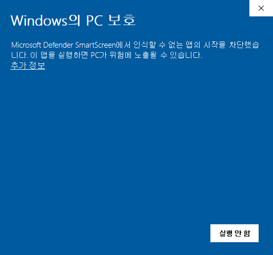

화면 중간의 `추가 정보`를 클릭하면 `실행` 버튼이 생성된다.

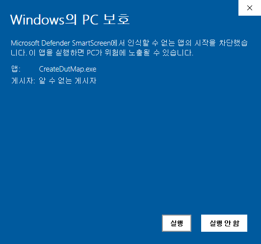

`실행` 버튼을 클릭하자.

아래와 같이 `DOS 창`, `브라우저(크롬, IE, ...)` 그리고, `Windows 보안 경고 창`이 생성된다.

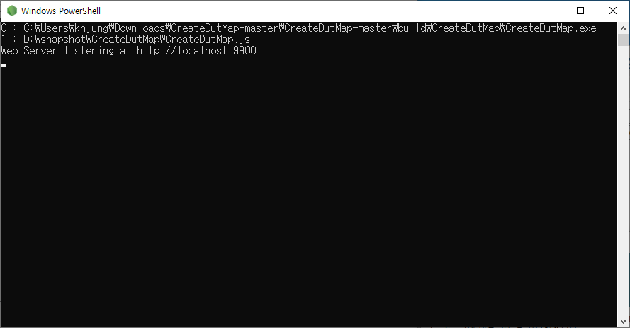
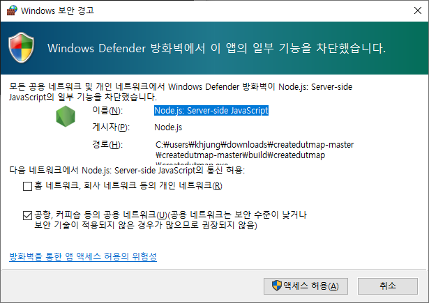
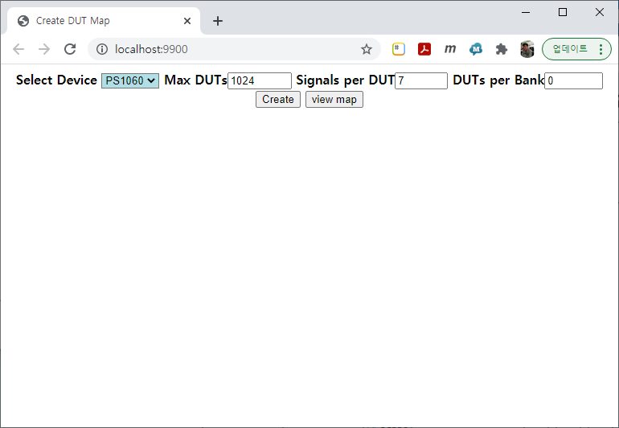

`Windows 보안 경고 창`에서 `엑세스 허용` 버튼을 클릭한다.

경우에 따라서는 아래와 같은 `브라우저 팝업창`이 생성될 수 있지만, 이 창은 실제 사용되지 않으므로 닫는 것이 좋다.

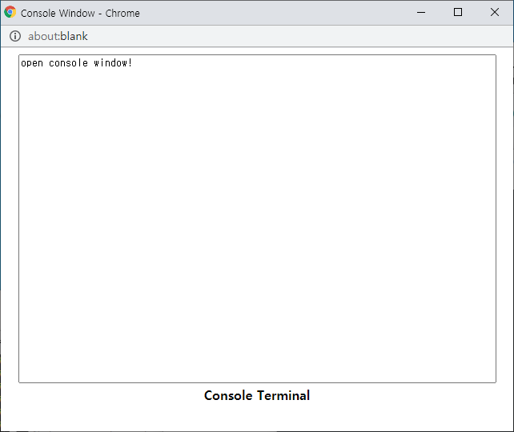


### CreateDutMap 사용하기.

앞서 실행된 `브라우저(크롬, IE, ...)` 화면에서 DutMap을 생성할 수 있다.

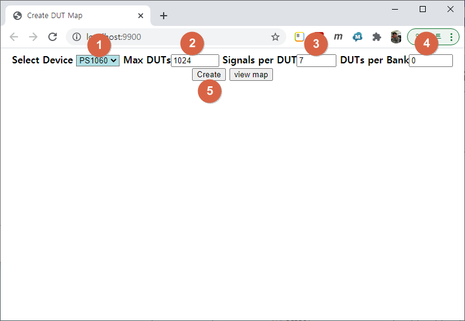

화면에서 각 항목의 의미는 아래와 같다.

| 항목 | 설명 |
|------|------|
| `Select Device` | Probe Card에 사용된 Switch Chip(PS1120/60/30)을 선택한다. |
| `Max DUTs` | Probe Card에 연결될 DUT의 개수를 입력한다. |
| `Signals per DUT` | 각 DUT에서 Switch와 연결된 Signal의 개수를 입력한다. |
| `DUTs per Bank` | (옵션)ATE장비에서 SPI Channel당 연결되는 최대 DUT 개수를 입력한다.  |
| `Create` 버튼 | DutMap을 생성한다. |
| `view map` 버튼 | 생성된 DutMap을 보여준다. |


1. 화면에서 `Select Device`에서 PS1120/60/30을 선택한다.

2. `Probe Card`에 연결되는 `DUT(Device Under Test)`의 개수를 지정한다.

3. `Signals per DUT`에서 각 DUT에서 Switch와 연결될 Signal의 개수를 입력한다.

4. 추가로 `DUTs per Bank`에 입력할 필요가 있다면 입력한다.

5. `Create` 버튼을 클릭한다.

### 결과 확인하기.

아래와 같이 화면에서 Default로 설정된 내용을 바탕으로 DutMap을 생성하였다고 가정하고 결과를 확인해 보자.

`Create` 버튼을 클릭하면, 아래와 같이 결과를 출력해 준다.

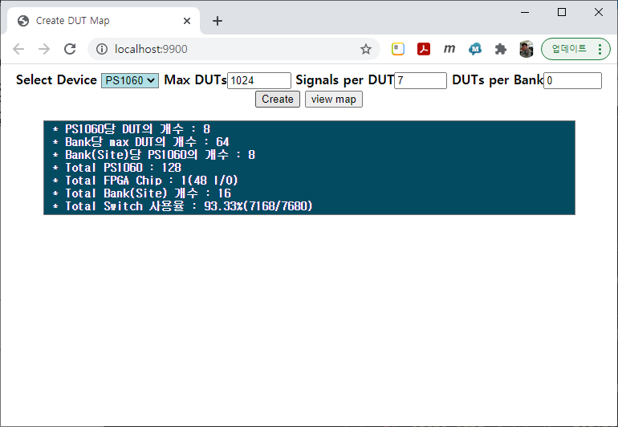

##### 출력된 결과 확인하기.

출결된 결과에는 7가지 항목이 있으며, 각각의 의미는 아래와 같다.

* PS1060 Device에 연결되는 DUT의 개수가 8개 이다.
* 1개의 Bank에 연결되는 DUT의 개수가 64개 이다.
* 1개의 Bank에 연결되는 PS1060의 개수가 8개 이다.
* Probe Card에 사용되는 PS1060의 전체 개수는 128개 이다.
* Probe Card에 사용될 FPGA Chip의 개수는 1개 이다.
* Probe Card에서 Bank의 개수는 16개 이다.
* Probe Card에서 Switch 개수는 7680개(128 x 60) 이고, 실제 사용된 Switch 개수는 7168개(1024 x 7)가 사용되었다.

##### 화면으로 결과 확인하기.

DutMap이 생성되었다면, `view map` 버튼을 클릭해 보자.

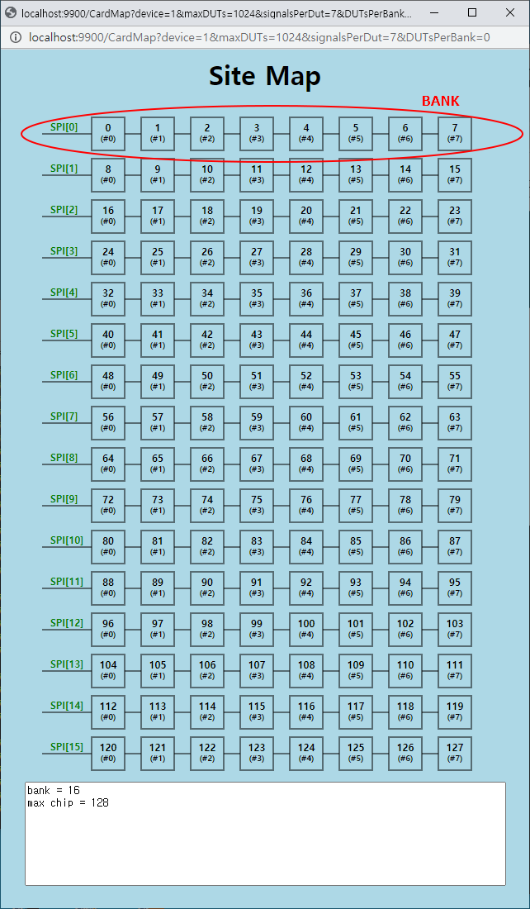

화면에서 `SPI[x]`라고 표시되는 각 라인은 Bank로 표시한다.

즉, Bank당 8개의 PS1060이 연결되어 있고, Bank의 개수는 16개 이다.

128개의 PS1060 중에서 각 PS1060을 클릭하여 좀더 자세한 사항을 볼 수 있다.

`SPI[0]`에서 첫번째 PS1060을 클릭해 보자.

아래와 같이 PS1060과 연결된 DUT를 보여준다.

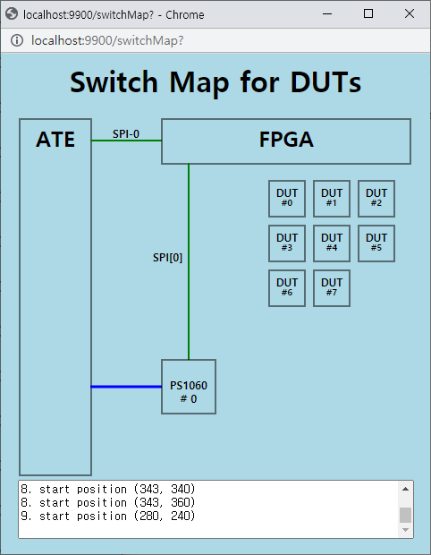

즉, ATE장비에서 `SPI-0`를 통해서 FPGA에 연결되고, FPGA에서 `SPI[0]`를 통해서 PS1060(ID : 0)이 6개의 DUT들과 연결되다는 것을 확인할 수 있다.

각 DUT와 PS1060의 Switch가 어떻게 연결되어 있는지 확인하기 위해서 화면의 DUT를 클릭해 보자.

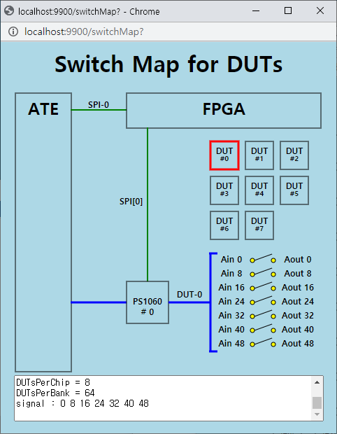

즉, DUT(0)의 7개 Signal은 PS1060의 Aout[0, 8, 16, 24, 32, 40, 48]에 연결된 것을 보여준다.

PS1060의 Switch 할당에 대해서는 다음 장에서 설명을 참조하기 바랍니다.

##### 생성된 파일 확인하기.

DutMap이 생성되면, 해당 폴더에 `DutMap.json` 파일과 `DutMap_xxxxxxx.xlsx` 파일이 생성된다.

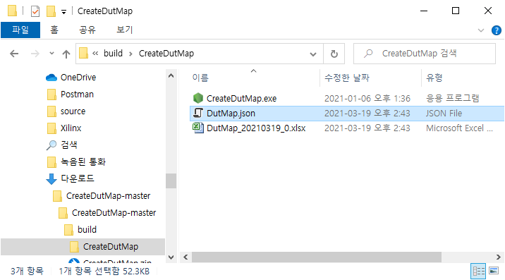

먼저 `DutMap_xxxxxx.xlsx` 파일을 열어서 내용을 확인해 보자.

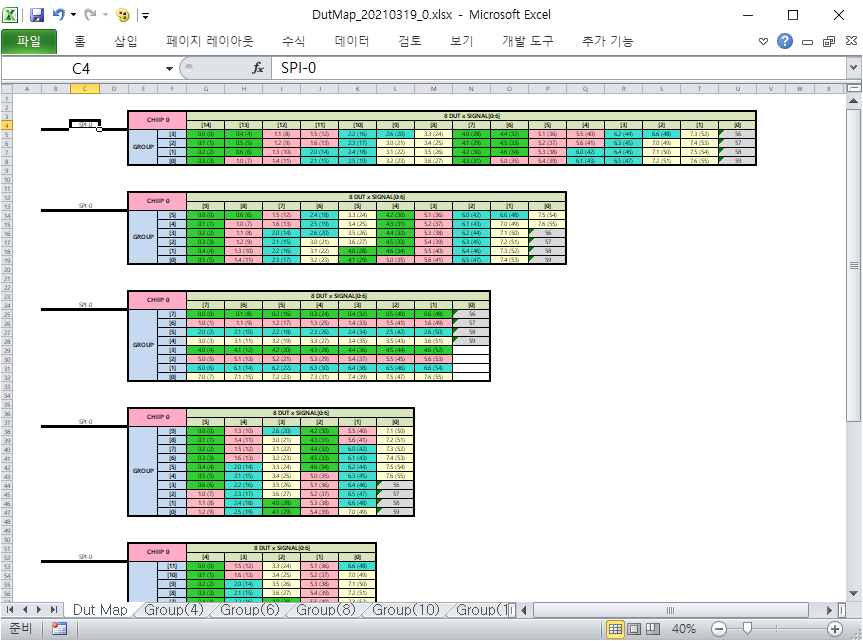

첫 번째 Sheet(Dut Map)에는 Group별로 PS1060에 연결되는 DUT와 Signal 정보를 보여준다.

즉, 첫 번째는 4-Group으로 구성했을때 DUT와 연결된 Switch 정보를 보여주고, 두 번째는 6-Group으로 구성했을때를 보여준다.

차례대로 8-Group, 10-Group, 12-Group, 16-Group에 별로 PS1060의 각 Switch가 DUT와 연결되는 정보를 보여준다.

먼저 8-Group의 내용을 보면서 각 Cell의 의미를 확인해 보자.

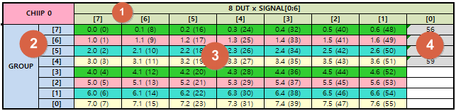

1. Column의 번호를 보여준다.(PS1060 Command에서 사용된다.)

2. Row의 번호를 보여준다.(PS1060 Command에서 사용된다.)

3. 각 cell은 `x.y(z)` 형식으로 보여준다.
    * x : DUT의 번호를 의미한다.
    * y : DUT에서 Signal의 번호를 의미한다.
    * z : PS1060의 Switch 번호를 의미한다.

    예) `7.1(15)`는 DUT[7]의 Signal[1]이 PS1060 Switch[15]와 연결된다는 것을 보여준다.

4. 회색(gray)로 표시된 Cell은 사용되지 않은 PS1060 Switch를 보여준다.


두 번째 Sheet부터는 각 Group(4/6/8/10/12/16) 별로 전체 Probe Card에 PS1060이 연결된 상태를 보여준다.

예로써 `Group(8)` sheet를 보자.

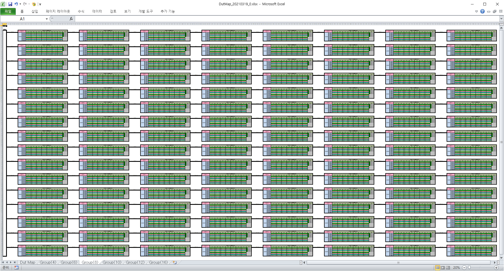

각 Bank에는 PS1060이 8개씩 연결되어 있고, 16개의 Bank로 구성된다.

확대해서 보자.

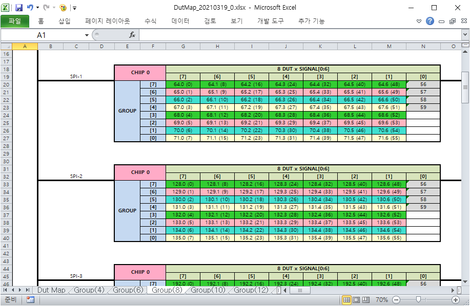

Bank[1]과 Bank[2]에서 첫번째 연결된 PS1060의 Switch 할당 내역을 확인할 수 있다.

엑셀 파일과 JSON파일에서는 모든 Group에 대해서 Switch할당을 보여주지만, HTML(브라우저)에서는 대표적인 1개의 Group만을 보여준다.

```
엑셀 파일(xlsx)의 첫 번째 Sheet에서 Group별로 DUT가 할당된 모양을 보면, 8-Group에서 DUT의 Signal들이 Row/Column 단위로 정렬되어있다.

이렇게 DUT의 Signal들이 Row/Column단위로 정렬되면, PS1060의 Command를 효율적으로 사용할 수 있기 때문에 Switch 제어가 용이하다.

앞서 HTML(브라우저)에서 DUT의 Signal과 PS1060의 Switch 할당은 위의 내용(Row/Column 정렬)을 바탕으로 최적의 조적으로 구성한 것이다.
```
